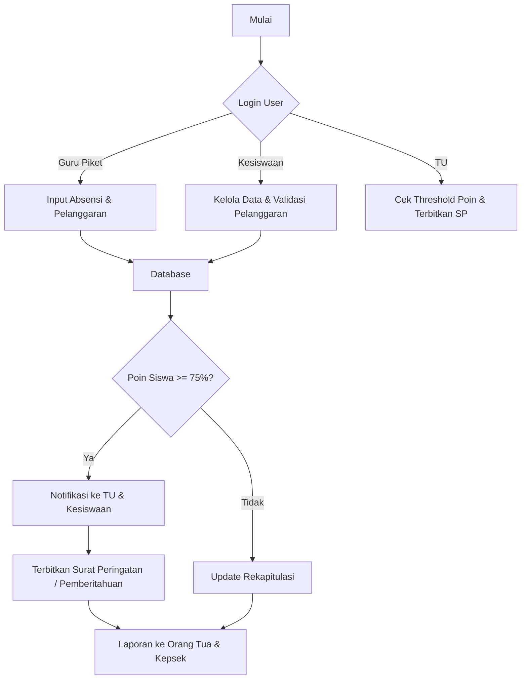

# Diagram Alur Sistem

Diagram berikut menggambarkan proses utama dalam sistem, mulai dari login user hingga penerbitan Surat Peringatan (SP) dan laporan.

## Keterangan alur

- Guru Piket: memasukkan absensi harian dan pelanggaran.
- Bagian Kesiswaan: mengelola data pelanggaran dan memvalidasi entri.
- Bagian TU: mengecek ambang poin dan memulai proses SP.
- Jika poin siswa mencapai 75% atau lebih, sistem memberi notifikasi dan menerbitkan Surat Peringatan.
- Hasil akhirnya adalah laporan untuk Orang Tua dan Kepala Sekolah.